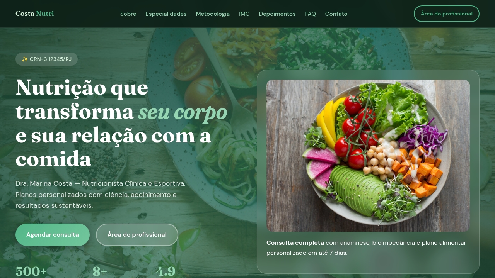
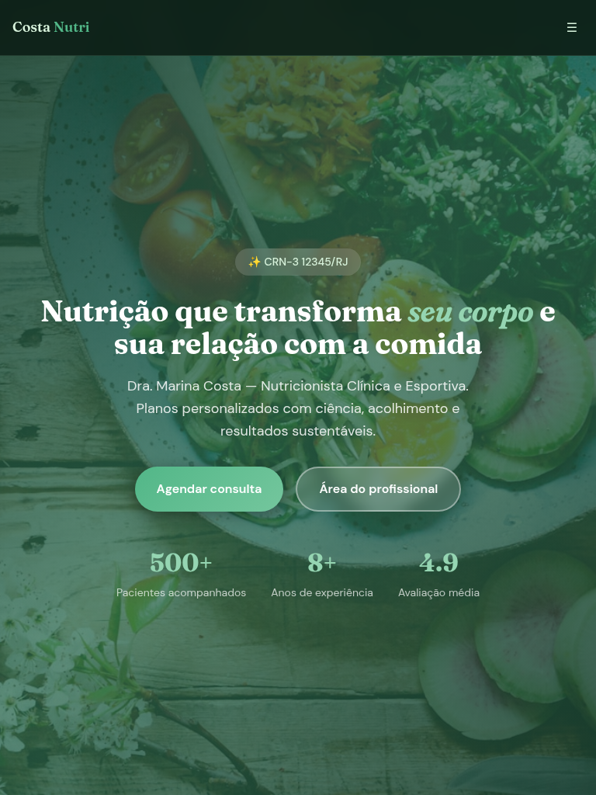

# Nutricionista — Landing & Painel Demo

Demo completo para nutricionista em React + Vite: landing de alta conversão com calculadora IMC, formulário WhatsApp e mini-app de gestão de pacientes (localStorage).

[](https://tofariasti.github.io/landing-nutricionista/)

## Demo

**Moldura (preview):** [https://tofariasti.github.io/landing-nutricionista/](https://tofariasti.github.io/landing-nutricionista/)

**Tela cheia:** [https://tofariasti.github.io/landing-nutricionista/site/](https://tofariasti.github.io/landing-nutricionista/site/)

## Screenshots

### Desktop (1280px)


### Tablet (768px)


### Mobile (390px)


## Funcionalidades

### Landing pública
- Hero animado com estatísticas e CTAs
- Sobre, especialidades, metodologia
- Calculadora IMC interativa com classificação
- Depoimentos, FAQ accordion
- Formulário estruturado → WhatsApp
- Botão flutuante WhatsApp

### Mini-app (painel demo)
- Dashboard com resumo e próximas consultas
- CRUD de pacientes (localStorage)
- Plano alimentar editável por paciente
- Configurações: tema claro/escuro, reset demo

## Tecnologias

- React 19 + TypeScript + Vite
- React Router (HashRouter)
- Framer Motion
- Vitest + Testing Library
- Playwright + axe-core
- GitHub Pages

## Testes

```bash
npm test              # Vitest (unit/integration)
npm run test:e2e      # Playwright (requer build + servidor)
```

## Desenvolvimento local

```bash
npm install
npm run dev           # Vite dev server
npm run build         # Build para site/
python3 -m http.server 8765   # Moldura + site
```

## Screenshots (geração)

```bash
python3 -m http.server 8765
npm run build
npm run screenshots
```

## Testes de Responsividade

| Dispositivo | Resolução | Status | Verificado |
|-------------|-----------|--------|------------|
| iPhone SE | 375×667 | ✅ | Menu mobile, IMC, formulário |
| iPhone 14 | 390×844 | ✅ | Hero, cards, WhatsApp float |
| iPad | 768×1024 | ✅ | Grid especialidades, FAQ |
| Desktop HD | 1280×720 | ✅ | Layout completo, moldura |
| Desktop FHD | 1920×1080 | ✅ | Max-width container |

## Acessibilidade

- WCAG 2.1 AA (contraste, foco, labels)
- Skip link, landmarks, ARIA
- `prefers-reduced-motion` respeitado
- Checklist completo: [docs/a11y-checklist.md](docs/a11y-checklist.md)

## Estrutura

```
nutricionista/
├── index.html              # Moldura iframe
├── assets/css/preview.css
├── assets/js/preview.js
├── src/                    # React source
├── site/                   # Build output (Vite)
├── screenshots/
├── e2e/                    # Playwright tests
├── scripts/capture-screenshots.mjs
└── .github/workflows/deploy.yml
```

## Personalização

1. **WhatsApp:** `WHATSAPP_NUMBER` em `src/config/constants.ts`
2. **Persona:** `NUTRITIONIST` em `src/config/constants.ts`
3. **Cores:** variáveis CSS em `src/styles/global.css`

---

<p align="center">
  <a href="https://tofariasti.github.io/landing-nutricionista/">🌐 Demo Online</a> ·
  <a href="https://fariasdigital.com.br/">🏢 Site Comercial</a>
</p>

<p align="center">
  Desenvolvido por <a href="https://fariasdigital.com.br/">Farias Digital</a>
</p>
